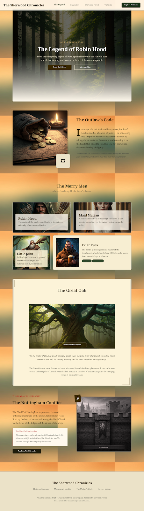

# Historia - Robin Hood

## Descripción

El objetivo del proyecto es crear una web interactiva que describa la historia de **Robin Hood**, utilizando las herramientas **HTML y CSS3** HTML y CSS3.

## Planificación

1. Se creará una plantilla del diseño en Google Stitch.
2. Se utilizará el repositorio de **GibHub** para cargar los ficheros (HTML y CSS) y actualizar el codigo.
3. Se establecera una estructura ordenada para crear la pagina web.
4. Se utilizará **Visual Studio Code** para el desarrollo del codigo de la pagina.
5. Se utilizará **GitHub Pages** para visualizar el resultado.

## Diseño de la pagina web
